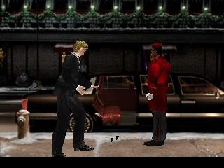
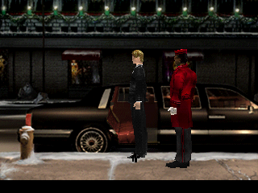

# PE-POLY1 — visible opening character models

2026-09-04 native port continuation. Two character models are visibly rendered
beside the limousine in M0010I. They change pose/location between 120 and
600 frames. Both captures were inspected. **Aya is not yet controllable and
has not reached the auditorium entrance.**

## Changes

- Restored 65B70 camera initialization in 68B94 before view application.
  BCFA4/BCFA8 now point to B89F8/B8A18; the retail view record populates
  the camera instead of leaving its rotation zero. Authority: 65B70..65C38
  and call at 68BAC, `asm/disc1/55C00.s`.
- GPU GP0 20h..3Fh polygon parsing: flat/Gouraud triangles/quads, opaque/
  semi-transparent, textured/raw/modulated. Integer affine interpolation,
  triangle edge ownership, 4/8/15-bit texture sampling, palettes, texture
  windows, drawing offset/area, mask bits, dithering and blend modes.
  Quads split into vertex triples (0,1,2) and (1,2,3). Hardware format source:
  https://psx-spx.consoledev.net/graphicsprocessingunitgpu/
- Connected existing 3B97C lighting in model initialization and opcode 9B.
- Restored 357B4..35988 world-transform publication for constructed models:
  actor integer pose, Euler rotation and scale before the joint walk.
- Added polygon/pixel counts to CLI GPU telemetry.

## Validation and limits

Normal and ASan/UBSan CTest pass 2/2 each, 1,088/1,088 native cases, no
sanitizer diagnostics. Logs `/tmp/pe-poly-tests.log` and
`/tmp/pe-poly-san-tests.log`. The old unsupported-GP0 test now uses line 40h;
polygon 20h is supported. New `POLY1_gpu_shared_edge_and_texture` checks
quad coverage/no shared-edge double draw, raw paletted texture sampling,
mask protection and parser completion. Opening integration requires published
camera output pointers, nonzero rotation and rasterized polygon pixels.

This is a native rasterizer, not an independently validated bit-exact GPU.
Edge/interpolation rounding lacks a hardware frame comparison. Texture cache,
interlace/display-area draw restrictions and hardware timing remain outside
the implemented subset. The visual captures prove character rendering; they
do not prove correct collision, complete animation or playable field state.

## Next script dependency

A temporary RAM snapshot at 600 frames (`/tmp/pe-poly-600-ram.bin`) shows Aya
at 800BED10 with input lock D2E8=3, main task 8009D33C delay=0 and PC=801B1A80.
The preceding opcode CD at 801B1A78 dispatches to 80019CEC, currently unwired.
That 14-word leaf copies signed actor+21C/+21E/+220 to world pose +28/+2C/+30
and returns 1. Those source fields depend on the currently-empty nonzero-model
3A6A8 path. Finish that dependency before wiring CD; copying its current zero
fields would teleport Aya. Remaining task flags: type 2 task 8009D3EC=60014,
type 3 task 8009D394=40010. Snapshot code was removed and the CLI rebuilt.
